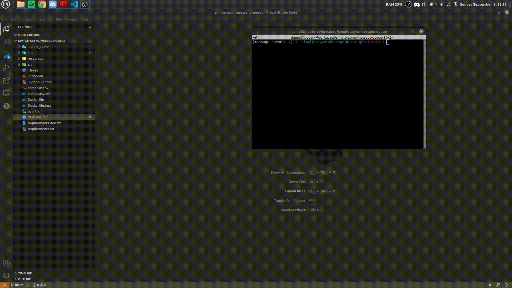
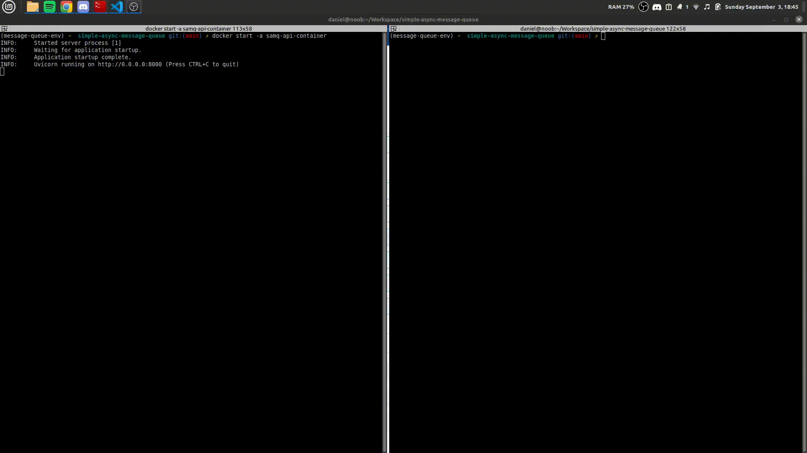

# Simple Async Message Queue

This project implements a message queue and workers to consume this messages.

The messages are sent to queue through API and the workers use the same API to consume them.

The API provides a route to create the messages and insert them into queue, as also an route to load submission from excel files with examples in [/resources](resources).

## Running application

This topic will show how to run the application using Docker and compare some operations realizade using sync and async ways.

### Starting API
```bash
docker compose --env-file=compose.env down --remove-orphans # if I have containers to remove
docker compose --env-file=compose.env create --build # to create the containers by each service writed in compose with the same configuration
docker start samq-database-container # starting database
docker start -a samq-api-container # starting api
```



### Inserting items

In this example below, the application will insert `21 items` into queue using 2 approaches. 

obs: To simulate a processing time during the creating of message, the method called to create a "record" sleep for 3 seconds and then the message is created.

The first one will running a container that insert one by one and this operation takes more than 1 minute to execute(`65.23 seconds`)

The second one will insert the same data using an API route to upload the file(`/file/upload`) and process data. This route takes just `5.25 seconds` to process the data, 12x faster! A nice thing when working with a lot of data.

This speedup is because the used route to upload file was implemented to process data using an [async_queue.py](/src/common/async_queue.py)([Queues - Python](https://docs.python.org/3/library/asyncio-queue.html)).


### Inserting 1k items

Using the same route above (`/file/upload`) to insert 1k items in message queue.

obs: To simulate a processing time during the creating of message, the method called to create a "record" sleep for 3 seconds and then the message is created.

The application takes `43.26 seconds` to insert 1k items into queue. Internally, the async queue that will process the requests has a size of 400.

It's means that, when this queue is full or the item to process from file is the last, the requests will be called asynchronously.

For this reason the application logged that 400 items was consume, 400(again) and finally 200, totalizing 1000 items(size of uploaded file).



### Consuming workers

This below example, the application will consume the messages using 2 approaches.

obs: To simulate a processing time during to consume a message, the worker that is called will sleep for 5 seconds before complete the consume of the message.

The first one will fetch the queue and when exists some message to consume, get just 1 and consume it.

The second one will fetch the queue using a batch to return the messages and will consume all batch asynchronously. In this example the batch size is 50, so, 50 items will fetched and consumed shortly thereafter.

While the first approach takes 5 seconds to consume just once message, the second one takes the same time to consume a batch, in this case, 50 items!


## Used Technologies

* FastAPI
    - Implements the API that realize load submission to insert data in database
    and fetch data to be consumed.
* Tortoise ORM
    - Implements models to build tables and interact with database(select, create, etc.).
* Docker
    - Containizered the project to run the applications in containers.
* PostgreSQL
    - Database to store data.
* Pytest
    - used to implements a suit test for API routes.
* Pandas
    - used to read data from excel after upload file
* HTTPX
    - async client